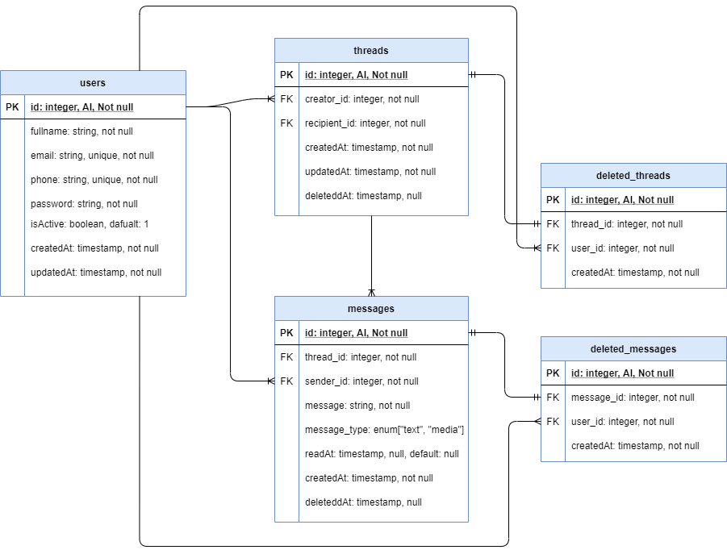
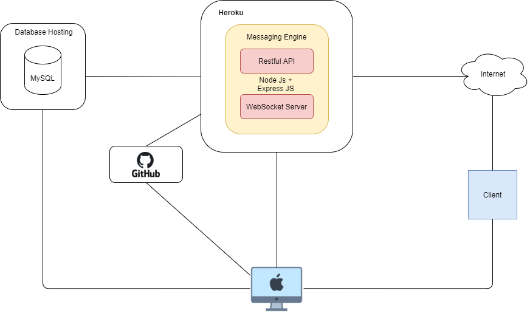

# Messaging API built on NodeJs

Simple messaging API built on NodeJs runtime and comes with authentication feature, it's not a real-time system and it may have a lot of flaws, but it'll be continuously developed

## Installation

Before making an installation, make sure you have the following requirements:

- Node Js installed on your machine
- NPM (Node Package Manager), basically it'll be installed automatically within the NodeJs
- MySQl database
- Git installed on your computer

To install the project, here is the step

- Clone the project with command `git clone https://github.com/achjailani/messaging-engine.git`
- Change directory, I assume the folder name is messaging-engine `cd messaging-engine`
- Install required packages `npm install`, wait for till it done
- Duplicate `.env.example` file and rename it to `.env`
- Configure the database connection and other configuraions in `.env` file
- Migrate the miration files to generate all required tables `npx sequelize db:migrate`
- And here we go, now we can run it with command `npm run happy5:dev` for development and and `npm run happy5:prod` for production

## API Documentation

API Documentation could be found [here](https://github.com/achjailani/messaging-engine/blob/develop/API_DOCS.md) or yaml file [here](https://github.com/achjailani/messaging-engine/blob/develop/messaging_feature_insomnia_api_docs.yaml), this file was exported from Insomnia

## Tools, Stacks and Packages

- [NodeJs](https://nodejs.org/) as a Backend
- [ExpressJs](http://expressjs.com/) is a NodeJs slim framework
- [MySql](https://www.mysql.com/) as a Databased Used
- [Json Web Token](https://jwt.io/) is a package for aunthentication
- [Dotenv](https://www.npmjs.com/package/dotenv) as package used to load environment variables from .env file
- [Mysql2](https://www.npmjs.com/package/mysql2) is a mysql driver to MySql database
- [Sequelize](https://sequelize.org/) is an ORM package (Object Relational Mapping) for NodeJs
- [validatorJs](https://www.npmjs.com/package/validatorjs) is package for validator
- [Cors](https://www.npmjs.com/package/cors) is a package to handle Cors

## Database Design

## Artchitecture Plan

